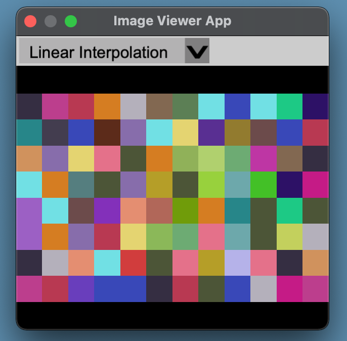
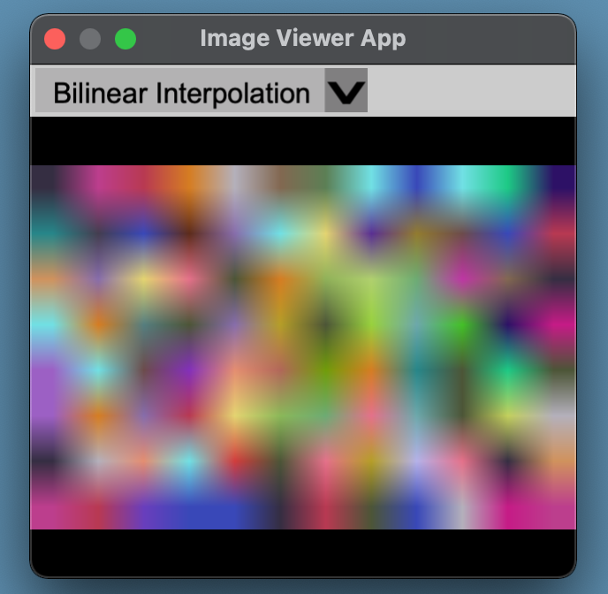
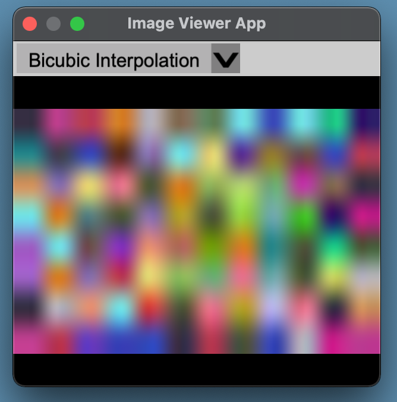

# Image Viewer App
An image viewing app that can display images using linear, bilinear, or bicubic interpolation.

# Examples
## Nearest Neighbor

## Bilinear

## Bicubic

# Install
1. Make sure the build folder is empty.
2. Run make in folder that contains GNUmakefile
3. Built app will be in the build folder